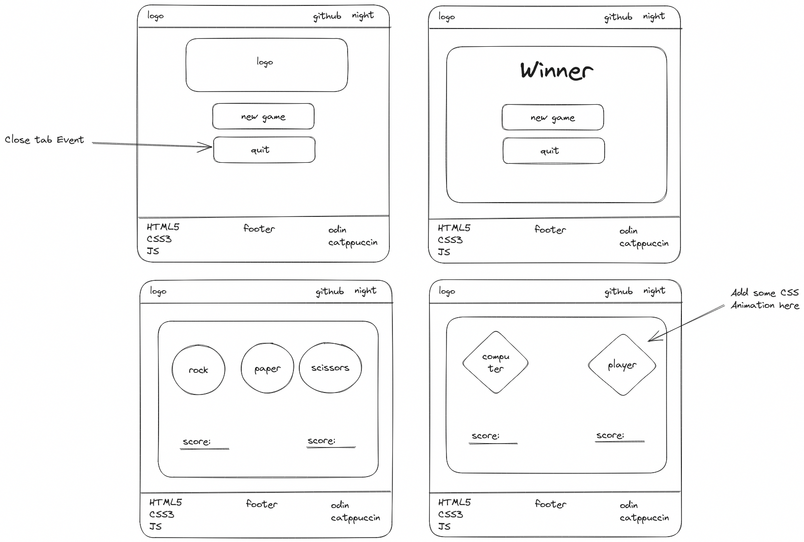

# Rock Paper Scissors

Simple implementation of grade-school classic “rock paper scissors”. It is part of the curriculum for The Odin Project's Foundation path.

### To-do
- [x] Implement core logic
  - [x] Get random choice for computer
  - [x] Get player choice manually
- [x] Winning logic
  - [x] Core logic
  - [x] Add comparing function
  - [x] `return` proper value
- [x] Game rounds
  - [x] Single round
  - [x] Loop 5 times
  - [x] `console.log` each round's score
  - [x] `console.log` the end result
  - [x] Report about the winner
- [x] Use `prompt` to get user input
- [ ] UI
  - [ ] Enhance Node environment
  - [ ] Browser
    - [x] [wireframe](#Wireframe)
    - [x] night/dark mode
    - [x] header
    - [ ] Quit button "Scripts may close only the windows that were opened by them :( "
    - [x] intro
    - [x] main
    - [ ] footer
    - [ ] game over UI
    - [ ] controllers

## Demo

You can play the game online in browser console [here](https://i4pg.github.io/rock-paper-scissors/).

## Features

<!-- *   Two players can play the game (X and O). -->
<!-- *   Players can take turns marking spaces on a 3x3 grid. -->
<!-- *   The game ends when a player gets three in a row or all spaces are filled without a winner. -->
<!-- *   The winner is displayed at the end of the game. -->
<!-- *   The game keeps running and calculating points. -->
<!-- *   It supports single player so you can play against a computer. -->
<!-- *   The computer uses a simple algorithm that takes all the available moves, then loops twice. First, it tries each move and plays it if it's a winning move; otherwise, it goes to the next move. Second, if there is no winning move, it tries each possible move and plays there if it's preventing the opponent from winning; otherwise, it chooses a random place to play. -->
<!-- *   It has a mobile-first responsive design, using [Bulma.io](https://bulma.io/). -->

## Showcase

### Wireframe



<!-- Here are some screenshots of the Rock Paper Scissors game: -->

<!--  -->

<!--  -->

## Getting Started

### Usage

You can play the game online in browser console [here](https://i4pg.github.io/rock-paper-scissors/).

### Installation

To run this program locally, you can clone the repository to your local machine using the following command:

`git clone https://github.com/i4pg/rock-paper-scissors.git`

Then open the `index.html` file in your web browser to start playing the game.

Or simply run 
```bash
$ node scripts/app.js
``` 
to play in your Terminal

## Contributing

Contributions to this project are welcome. To contribute, follow these steps:

1.  Fork this repository.
    
2.  Create a new branch with your changes:
    
    `git checkout -b my-new-branch`
3.  Make your changes and commit them:
    
    `git commit -am 'Add some feature'`
4.  Push your changes to your forked repository:
    
    `git push origin my-new-branch`
5.  Create a pull request on this repository.
    

## License

This project is licensed under the MIT License. See the [LICENSE](LICENSE) file for details.
