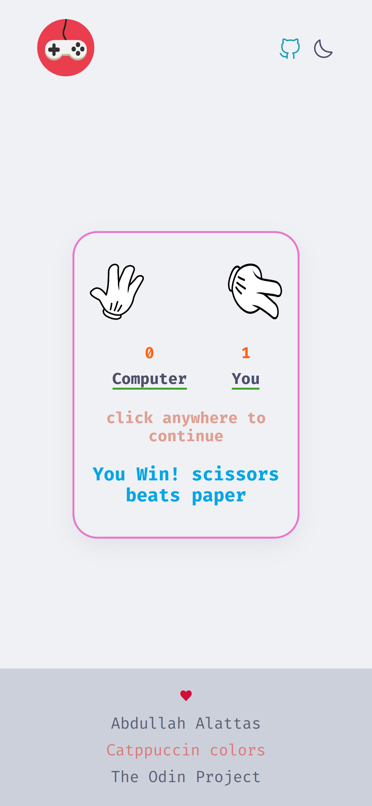
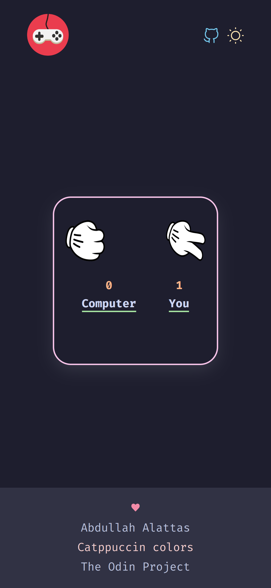
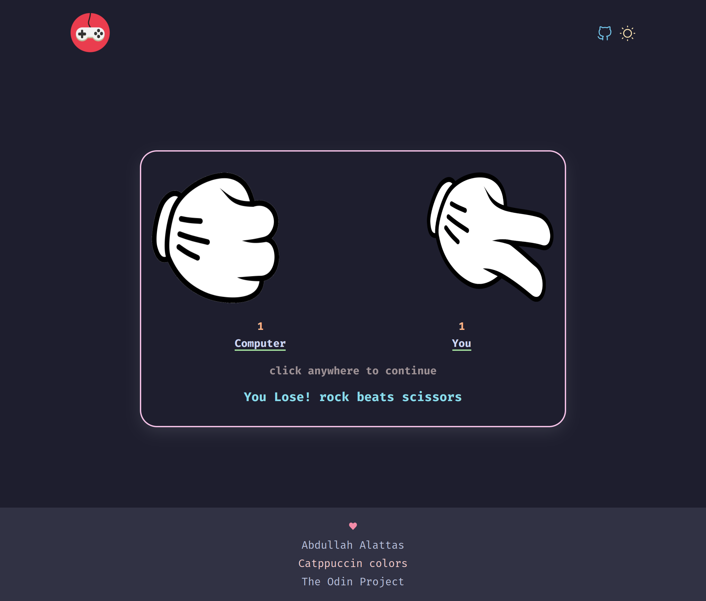
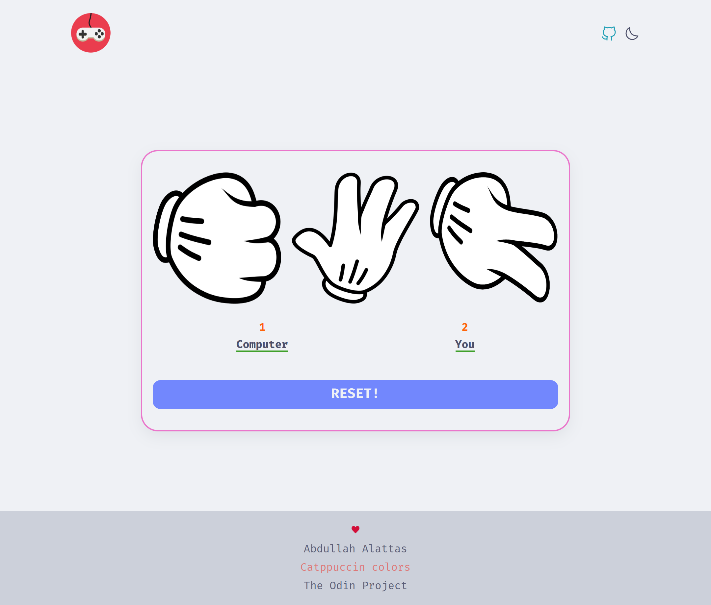

# Rock Paper Scissors

Simple implementation of grade-school classic “rock paper scissors”. It is part of the curriculum for The Odin Project's Foundation path.

### To-do
- [x] Implement core logic
  - [x] Get random choice for computer
  - [x] Get player choice manually
- [x] Winning logic
  - [x] Core logic
  - [x] Add comparing function
  - [x] `return` proper value
- [x] Game rounds
  - [x] Single round
  - [x] Loop 5 times
  - [x] `console.log` each round's score
  - [x] `console.log` the end result
  - [x] Report about the winner
- [x] Use `prompt` to get user input
- [ ] UI
  - [ ] Enhance Node environment visibility
  - [ ] run game.js from gameConsole.js
  - [x] Browser
    - [x] [wireframe](#Wireframe)
    - [x] night/dark mode
    - [x] header
    - [ ] Quit button "Scripts may close only the windows that were opened by them :( "
    - [x] intro
    - [x] main
    - [x] footer
    - [x] game over UI
    - [x] controllers
        - [x] 5 rounds game

## Demo

You can play the game online in browser console [here](https://i4pg.github.io/rock-paper-scissors/).

## Features

* Nice shuffling for rock paper scissors choices
* Light/Dark mode
* The winner is displayed at the end of the game.
* The game keeps running and calculating points.
* Responsive mobile-first design

## Showcase

### Wireframe


### ScreenShots






## Getting Started

### Usage

You can play the game online in browser console [here](https://i4pg.github.io/rock-paper-scissors/).

### Installation

To run this program locally, you can clone the repository to your local machine using the following command:

`git clone https://github.com/i4pg/rock-paper-scissors.git`

Then open the `index.html` file in your web browser to start playing the game.

~~Or simply run to play in your Terminal~~
```bash
$ node scripts/app.js
``` 

## Contributing

Contributions to this project are welcome. To contribute, follow these steps:

1.  Fork this repository.
    
2.  Create a new branch with your changes:
    
    `git checkout -b my-new-branch`
3.  Make your changes and commit them:
    
    `git commit -am 'Add some feature'`
4.  Push your changes to your forked repository:
    
    `git push origin my-new-branch`
5.  Create a pull request on this repository.
    

## License

This project is licensed under the MIT License. See the [LICENSE](LICENSE) file for details.
